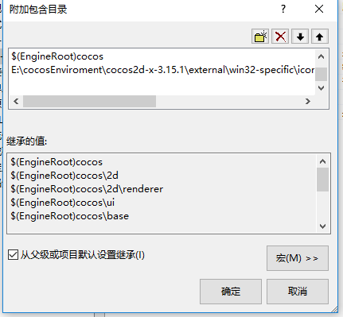
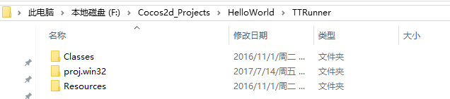
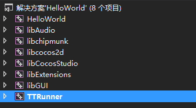

项目说明

1、本项目是使用cocos2d引擎模仿天天酷跑做的一个跑酷游戏
2、运行本项目之前，需要手动修改cocos2d-x的地址，TTRunner右键->属性->配置属性->c/c++->附加包含命令

对最后一行进行修改即可
3、下载本项目之后直接将文件复制到本地一个编译好的cocos2d项目中，再添加本项目并把TTRunner设置为启动项目即可，[详情](http://www.caihongqin.me/ru-he-rang-xin-chuang-jian-de-cocos2dxiang-mu-bu-yong-jing-guo-man-chang-de-bian-yi/)（注意，我使用的编译器为vs2012）
目录结构

项目解决方案结构

游戏效果图

